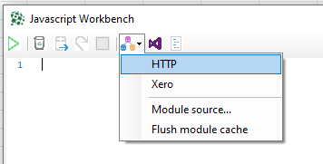
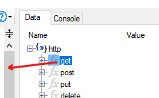

# XLConnect Modules
Public javascript modules for the XLConnect platform. 
[XLConnect](https://www.xlconnect.net) is an add-in to Excel that adds cloud connectivity and a datalake to Excel, turning it into a flexible and effective app development platform. 

## How to use 
In javascript workbench, use `Modules > HTTP` to insert that module into your code: 



`http = require('http.js')`

To add a function from that module to your code, it from the right hand pane into your code: 



That inserts this line into your code:

`http.get(uri, hds = null, auth = null)`

Edit that line the example below to grab FX data from the Data Lake:

```
fx_data = http.get('https://au.xlw.io/Public/msv/7fn6vy', null, 'xlc')
```

See [here](http://docs.xlconnect.net/javascript/) for the docs on how to use javascript in XLConnect. 
<br/>
<br/>

## How to edit or  create your own modules
If you want to debug edits to modules or create your own, download or fork the code to your local computer, say to path `C:\Users\<Your Username>\source\repos\XLC Modules\modules`. 
Then follow these steps to edit the XLConnect `settings.json` file:

* On the XLConnect tab in Excel, hit `Settings > Advanced > Local Data`
* Edit `settings.json` in VS Code for instance
* Insert the path above into the ModuleSearchPaths array, above the original line:
```
"ModuleSearchPaths": [
    "C:/Users/<Your Username>/source/repos/XLC Modules/modules",
    "https://raw.githubusercontent.com/XLConnect/modules/main"
  ],
```

* **Restart Excel** for the changes to take effect. 

### During development
* Make changes to the code, then save 
* In XLConnect Workbench, hit `Modules > Flush module cache`
* Run your code again to debug changes in module

When you execute `require('<modulename>')` in javascript, XLConnect will look for that filename in ModuleSearchPaths and use the first hit. It will cache that module to improve response times and save network traffic.

You can also use this to write your own modules, put them somewhere on the network or web and use them in your workbooks. 


## How to get XLConnect 
See [here](http://docs.xlconnect.net/) on how to create an account and download the add-in 

## In this repository
This online repo contains the following modules:
* `http.js` wrapper functions to streamline working with http requests 
* `xero.js` functions to make working with Xero api's a breeze
* `file.js` streamline working with data files in the data lake 

